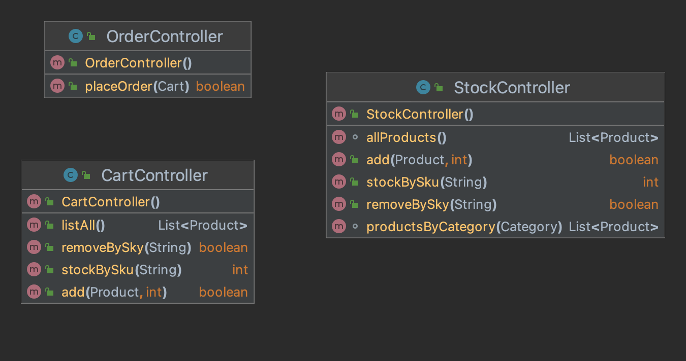
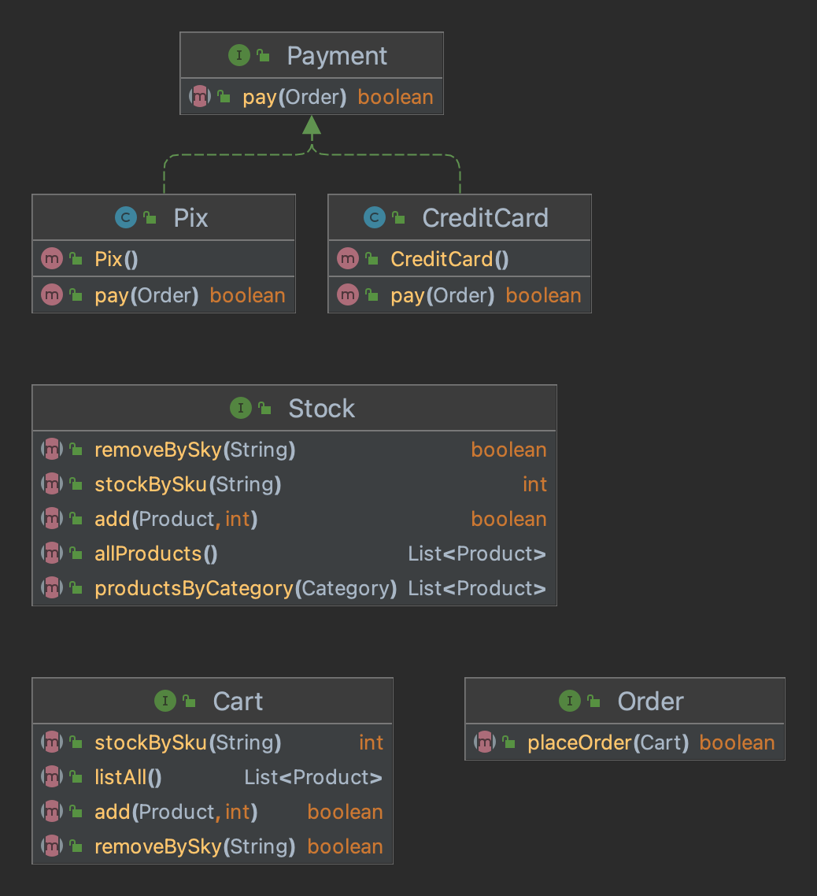
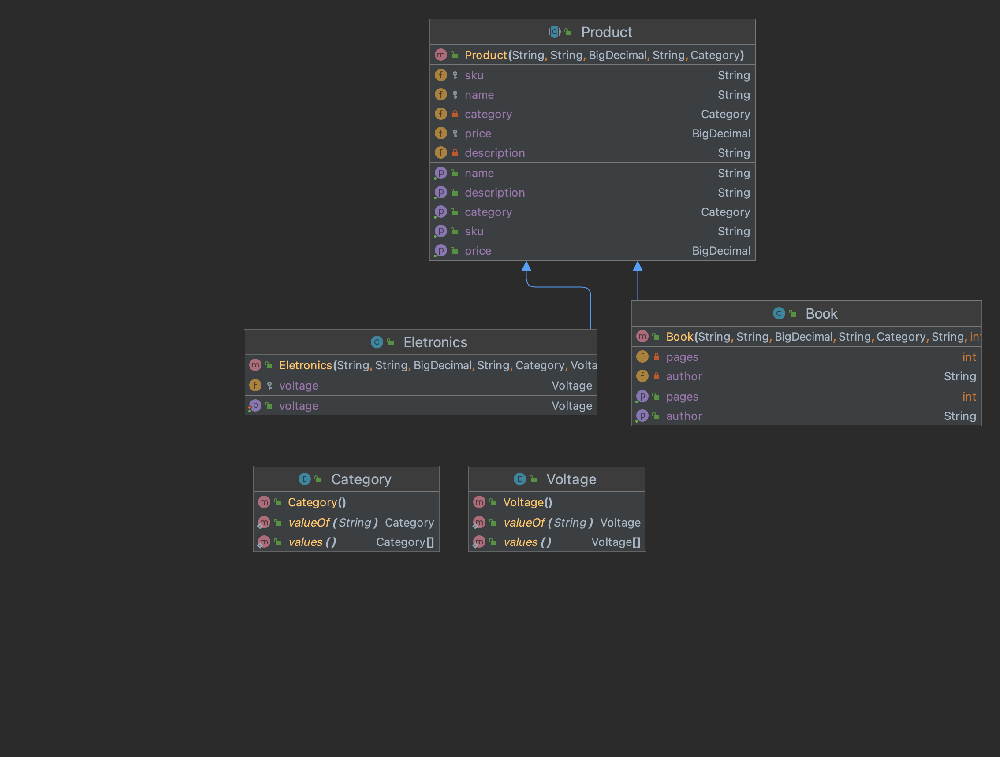

# Trabalho de reposição

Você foi contratado para desenvolver um sistema para a empresa TechReads Emporium de e-commerce que vende livros e eletronicos. 

Para isso, você planejou em organizar o sistema de forma a separar as responsabilidades facilitando a manutenção futura e organização geral do código.

Para isso, você criou os seguintes camadas:

# View

Essa é a camada de apresentação ao usuário onde estará implementada a lógica que interagirá com o usuário.

# Controller

Receberá as requisições vindas da camada de visualização e repassará a classe responsável. O controller não terá nenhum tipo de lógica, mas serve para escolher o caminho correto da operação.

# Service

Nessa camada as regras de negócio são efetivamente implementadas

# Model

Nesta camada estarão todo os modelos que representam as entidades do sistema

## Requisitos

Sabendo disso e considerando os diagramas e classes/interfaces fornecidos, implemente um sistema que contenha as seguintes operações:

1. Listar todos o produtos de determinada categoria
2. Adicionar produto ao carrinho (informando sku e a quantidade)
3. Remover produto do carrinho (informando o sku)
4. Realizar uma compra

> A lista de produtos (livros e eletrônicos) está fornecida nos arquivos books.csv e eletronics.csv. O seu programa deverá ler esses arquivos ao iniciar para compor o estoque da loja.

Observe a documentação das interfaces e implemente as classes necessárias para o correto funcionamento do programa. O programa deverá ter uma interface simples em modo texto.

### Regras de negócio

1. Ao realizar uma compra, as seguintes oeprações devem ser realizadas:
   1. Verificar disponibilidade no estoque
   2. Remover os produtos do estoque
   3. Zerar o carrinho de compras
4. Os pagamentos são obviamente simulações. Implemente simulação de dois tipos de métodos de pagamento: pix e cartão. Você poderá adicionar novos campos nessas classes para melhorar a representação.
